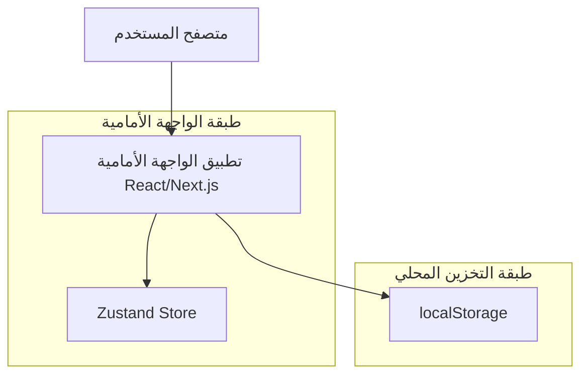

## 1. تصميم المعمارية

## 2. وصف التقنية

* الواجهة الأمامية: Next.js (React\@18) + tailwindcss + Zustand

* الخلفية: لا يوجد

* التخزين: localStorage (admin-products, assistant-chat)

## 3. تعريف المسارات

| المسار          | الغرض                                                   |
| --------------- | ------------------------------------------------------- |
| /assistant      | صفحة الشات، محادثة مع المساعد وعرض التوصيات والروابط    |
| /login          | تسجيل الدخول/OTP، استهلاك pendingWishlistItem ثم العودة |
| /products/\[id] | تفاصيل المنتج مع زر القلب وروابط قادمة من الشات         |

## 4. تعريفات API (عند وجود خلفية)

لا يوجد خلفية في هذا الإصدار؛ كل الحسابات محليًا دون استدعاء API.

## 5. مخطط خادم (عند وجود خلفية)

لا ينطبق.

## 6. نموذج البيانات (إن وجد)

لا توجد قاعدة بيانات؛ تُستخدم المفاتيح التالية في التخزين المحلي:

* admin-products: مصدر المنتجات (id, name, price, image, category...)

* assistant-chat: سجل المحادثة (messages)

### 6.1 أنواع البيانات المشتركة (واجهة داخلية)

* Message: { id: string, role: 'user'|'assistant', text: string, outfits?: Array<{ title: string, items: Array<{ label: string, product: Product }>, colors?: string\[], why?: string }>, ts: number }

* Product: { id: string, name: string, price: number, image?: string, category?: string, color?: string, gender?: 'male'|'female'|'unisex' }

### 6.2 توجيهات التنفيذ

* parseIntent(text): استخراج المناسبة/الستايل/الطقس/اللون/الميزانية/الجنس من النص العربي.

* recommend(prefs, products): توليد 2–3 إطلالات ضمن الميزانية من admin-products.

* formatReply(...): بناء رد مختصر وواضح (تأكيد، توصيات بروابط وأسعار، نصيحة قصيرة، سؤال متابعة).

* تكامل المفضلة: addToWishlist/removeFromWishlist/isInWishlist/setPendingWishlistItem عبر Zustand؛ عند عدم تسجيل الدخول تُستخدم pendingWishlistItem مع إعادة التوجيه ثم الإضافة التلقائية.

